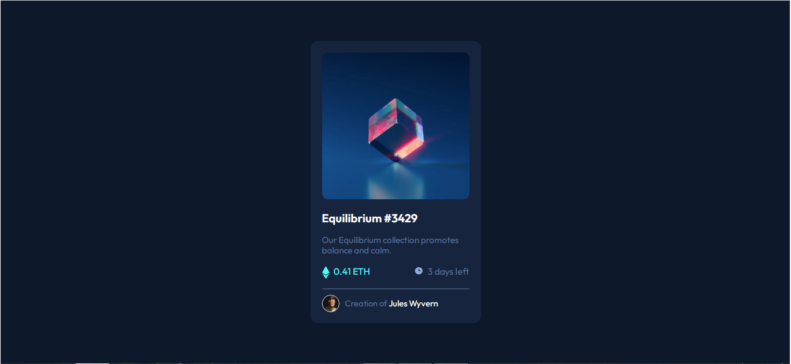

# Frontend Mentor - NFT preview card component solution

This is a solution to the [NFT preview card component challenge on Frontend Mentor](https://www.frontendmentor.io/challenges/nft-preview-card-component-SbdUL_w0U). Frontend Mentor challenges help you improve your coding skills by building realistic projects.

## Table of contents

- [Overview](#overview)
  - [The challenge](#the-challenge)
  - [Screenshot](#screenshot)
- [My process](#my-process)
  - [Built with](#built-with)
  - [Some thoughts](#some-thoughts)
  - [Continued development](#continued-development)
  - [Useful resources](#useful-resources)
- [Author](#author)
- [Acknowledgments](#acknowledgments)

## Overview

This challenge was so funny to make, because of the interactivity of the project.

### The challenge

Users should be able to:

- View the optimal layout depending on their device's screen size
- See hover states for interactive elements

### Screenshot

### Built with

- HTML5 markup
- Flexbox

### Some thoughts

- I still discovering how to deliver accurate measures of the projects, i think i will improve project by project.

### Continued development

I will focusing in developing my skills in frontend development, following the FrontendMentor site and personal projects.
I think that this is a great way to learn, by doing.

## Author

- GitHub - [Francisco Prado](https://github.com/franciscoprado4)
- Frontend Mentor - [@yourusername](https://www.frontendmentor.io/profile/FranciscoPrado04)

## Acknowledgments

My inspiration is to become a great developer and deliver great solutions to the world. And of course, get a great job.
# nft-card
